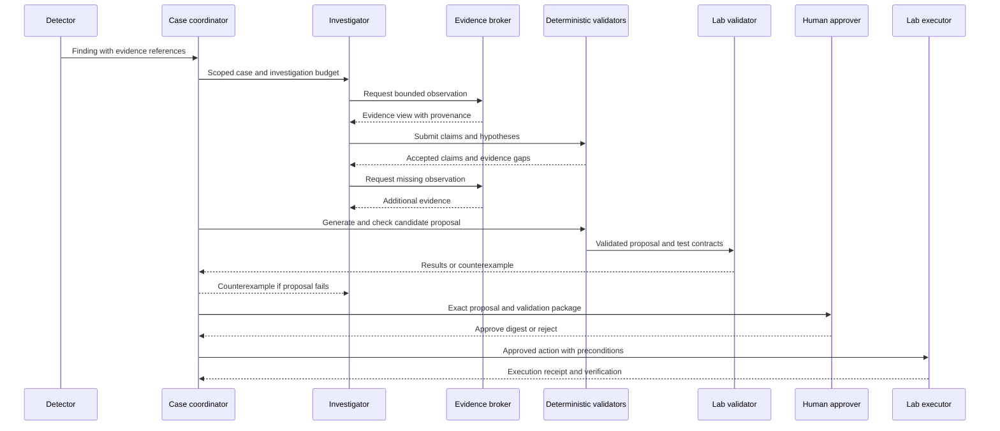
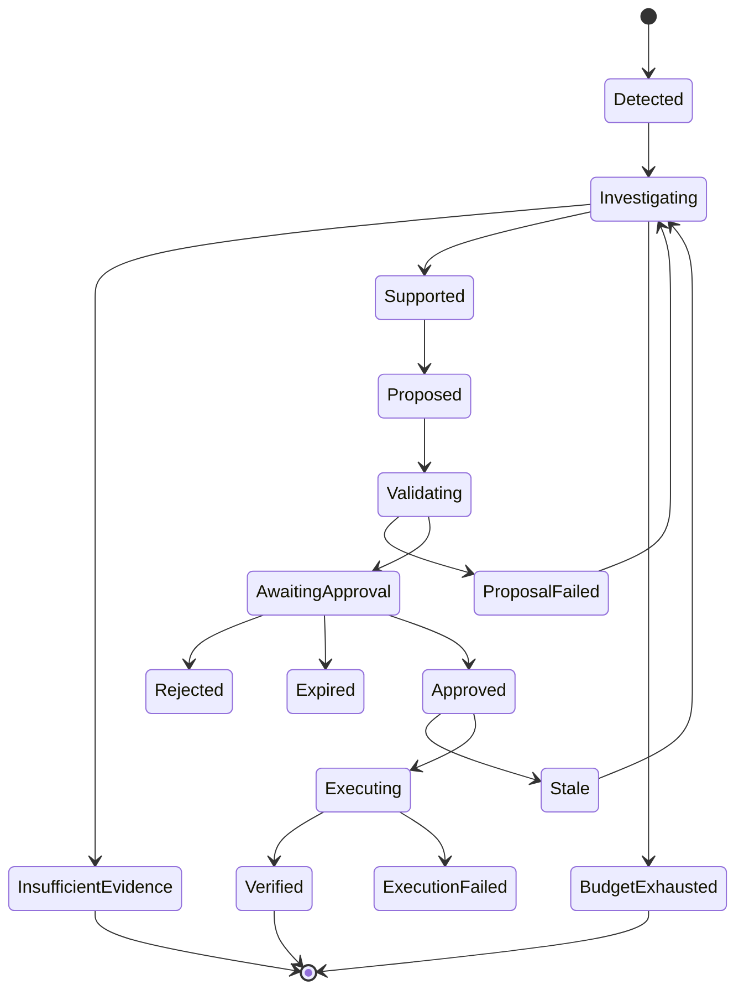
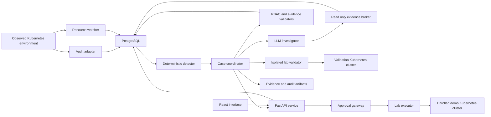
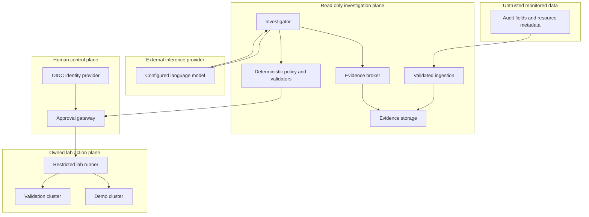

## REPRISE

**Tagline:** *Reconstruct the incident. Test the fix. Preserve the evidence.*

**REPRISE is an evidence-bound security investigation system that investigates Kubernetes identity incidents and tests proposed permission fixes against both attack regressions and legitimate workflows before requesting human approval.**

The defining feature is not that an agent can call security tools. It is that **every important claim and proposed action must pass an explicit evidence-and-validation contract**.

REPRISE should answer:

> “What did this identity demonstrably do, which permissions made that possible, what remains uncertain, and which narrowly scoped change blocks the demonstrated behavior without breaking the workflows we tested?”

Its output is an **incident evidence package and a tested remediation proposal**, not a conversational answer.

### The flagship demonstration

A deployment automation identity creates an unexpected Kubernetes RoleBinding. A workload service account subsequently reads a synthetic sensitive Secret.

REPRISE correlates the events, investigates competing explanations, reconstructs the relevant authorization paths, and proposes removing the unexpected binding.

Before recommending execution, it discovers an alternative permission path that makes the first proposed fix insufficient.

It then tests a corrected proposal in an isolated validation cluster:

| Validation | Result |
|---|---|
| Repeat the synthetic sensitive Secret read | Blocked |
| Run the workload’s legitimate ConfigMap read | Allowed |
| Run the expected deployment health check | Passes |
| Confirm the target binding has not changed since investigation | Matches |
| Confirm all material incident claims have evidence references | Passes |

An authorized human approves the exact proposal. REPRISE applies it **only to the owned demonstration cluster**, verifies the result, and produces a tamper-evident report.

That is the memorable moment:

> **The system rejects its own plausible but ineffective fix, finds why it would fail, and demonstrates a better fix without claiming more than it actually tested.**

### Deliberate scope

| Dimension | Decision |
|---|---|
| Initial security domain | Kubernetes service-account permissions and RBAC-related incidents |
| Primary signals | Kubernetes audit events and versioned RBAC/resource metadata |
| Initial risky behavior | Unexpected access to a named synthetic Secret |
| Initial remediation primitive | Delete a specific namespaced RoleBinding |
| Initial supported authorization model | An explicitly documented subset of native Kubernetes RBAC |
| Production-facing mode | Read-only investigation and exported proposals |
| Mutation mode | Explicitly enabled, isolated, owned laboratory environments only |
| Agent autonomy | Bounded evidence collection, hypothesis investigation, proposal generation, and isolated validation |
| Human authority | Incident disposition and any target-cluster permission change |
| AI requirement | Useful for adaptive investigation and explanations; never authoritative for permissions or execution |
| Student-sized first release | One excellent end-to-end incident family, not a general autonomous SOC |

**Feasibility assumption:** you know Python, basic TypeScript, Docker, and introductory Kubernetes. A credible first release is approximately **12–16 focused weeks**; a research-quality evaluation and hardening effort may take several additional months. Claude Code can do much of the implementation, but you remain responsible for threat modeling, reviewing permissions, validating results, and operating the lab.

---

# 2. Why this problem matters

## The gap is between investigation and safe remediation

Security products frequently identify suspicious activity, excessive permissions, or possible attack paths. The difficult operational questions come afterward.

| Operational problem | Why it is painful | REPRISE’s response |
|---|---|---|
| An alert does not establish what happened | Analysts must reconcile logs, identities, permissions, and change history | Build a claim-by-claim evidence graph |
| Current configuration is mistaken for historical configuration | Permissions may have changed after the event | Separate event-time evidence, contemporaneous observations, and present-day snapshots |
| A plausible permission fix does not remove all access paths | Kubernetes permissions are additive | Enumerate all supported grant paths and test the selected cut |
| A fix blocks the attack but breaks the application | Security findings rarely encode legitimate workload requirements | Run benign workflow contracts alongside attack regressions |
| LLM explanations sound more certain than their evidence | Fluent text can conceal unsupported attribution or causal leaps | Require structured claims with evidence and deterministic validation |
| Automated response is difficult to trust | Operators need scope, prerequisites, reversibility, and accountability | Bind approval to an exact proposal, state fingerprint, and validation artifact |
| Investigations are difficult to reproduce | Tool outputs and reasoning context disappear or drift | Preserve versioned artifacts and replayable investigation inputs |

## Target users

| User | Immediate value |
|---|---|
| Kubernetes security engineer | Understand which grants enabled a suspicious action and compare narrow fixes |
| Platform engineer | See whether a security change preserves explicitly tested application behavior |
| Incident responder | Obtain an auditable reconstruction without treating AI narrative as evidence |
| Detection engineer | Turn an incident into a repeatable regression scenario |
| Security researcher | Evaluate grounded agent investigations and remediation validation |
| Small security team | Gain disciplined investigation workflows without building a full SOAR platform |

## Why not choose a broader project?

A broad autonomous SOC agent would require many integrations, ambiguous evaluation, and substantial operational trust before its value became clear.

A generic attack-graph tool would have clear security depth but weaker justification for an LLM.

A generic remediation agent would have an impressive demo but weak safety guarantees.

**REPRISE concentrates on the intersection: adaptive investigation plus bounded, experimentally tested remediation.**

---

# 3. What makes it novel

## A defensible novelty claim

> **REPRISE combines evidence-constrained agent investigation, explicit authorization-path coverage, and paired attack/benign remediation regression tests in a single reproducible incident workflow.**

The intended contribution is the **integration and evaluation of these mechanisms**, not the invention of attack graphs, SOAR, Kubernetes authorization analysis, or AI-assisted investigation.

This is a project and research hypothesis—not a verified claim that no existing product or paper does something similar. A publication requires a systematic literature and product review.

## Position relative to established approaches

These comparisons describe familiar categories and documented purposes, not an exhaustive assessment of every current commercial feature.

| Existing approach | What it already does well | REPRISE’s specific focus |
|---|---|---|
| Falco or Tetragon-style runtime detection | Detect relevant runtime behavior | Start from a signal and produce evidence-bound permission remediation |
| Kubernetes audit analysis | Explain API-level activity | Connect observations to competing hypotheses and tested fixes |
| KubeHound-style attack-path analysis | Model Kubernetes attack opportunities | Distinguish possible access from observed action and validate incident-specific changes |
| Kyverno or Gatekeeper | Enforce configuration and admission policy | Investigate an incident and measure the effects of a proposed response |
| SOAR playbooks | Coordinate repeatable response actions | Require explicit evidence and regression-test artifacts before action approval |
| AI SOC assistants | Summarize and investigate alerts | Prevent unsupported claims from becoming authorization or execution decisions |
| Security validation platforms | Exercise security controls | Couple an investigation’s exact findings to a minimal, reproducible remediation test |

## The three central mechanisms

| Mechanism | Concrete implementation | Why it matters |
|---|---|---|
| **Evidence contracts** | Each material claim includes supporting artifact IDs, scope, timestamps, inference type, and limitations | Makes unsupported conclusions mechanically detectable |
| **Remediation contracts** | Each proposal declares exact mutations, prerequisites, security objectives, benign invariants, and rollback conditions | Turns “this should fix it” into a testable specification |
| **Paired regression validation** | Execute the suspicious authorization attempt and legitimate workflow contracts before and after the proposed change | Measures both containment effectiveness and known workflow preservation |

A fourth useful mechanism is **counterexample-driven repair**: when validation finds an alternative access path, it returns a structured counterexample to the investigator rather than a vague failure message.

### What REPRISE must not claim

| Unsupported claim | Correct claim |
|---|---|
| “We proved the cluster is secure” | “The proposal blocked these tested behaviors under this snapshot and supported model” |
| “The service account was compromised” | “The service account performed these observed actions; compromise is one possible explanation” |
| “No application will break” | “All supplied benign contracts passed” |
| “Removing the binding undoes the incident” | “Removing the binding removes this future grant path; previously read information remains exposed” |
| “The graph shows what happened” | “The graph distinguishes observed events from possible authorization paths” |

---

# 4. Core capabilities

## Functional requirements

| ID | Capability | Required behavior |
|---|---|---|
| F1 | Audit ingestion | Accept bounded, authenticated batches of Kubernetes audit events |
| F2 | Resource history | Track Roles, RoleBindings, ClusterRoles, ClusterRoleBindings, service accounts, and relevant workload metadata |
| F3 | Detection | Identify configured suspicious sequences and unexpected permission changes |
| F4 | Evidence storage | Preserve original accepted event bytes, normalized records, hashes, and provenance |
| F5 | Authorization analysis | Enumerate supported RBAC grant paths for a specific principal/action/resource tuple |
| F6 | Hypothesis investigation | Investigate malicious use, authorized change, telemetry ambiguity, and configuration drift |
| F7 | Evidence validation | Reject material claims without adequate supporting artifacts |
| F8 | Remediation generation | Produce only allowlisted, typed permission-change proposals |
| F9 | Counterexample search | Check whether alternative supported grant paths survive a candidate change |
| F10 | Shadow validation | Run paired authorization regressions and benign workflow tests in an isolated lab cluster |
| F11 | Approval | Require an authorized human to approve the exact proposal artifact |
| F12 | Execution | Apply approved actions only in explicitly enrolled lab environments |
| F13 | Post-change verification | Confirm the intended object change and repeat the relevant authorization check |
| F14 | Incident reporting | Export a structured JSON package and readable Markdown report |
| F15 | Reproducibility | Replay a stored incident fixture without live cluster access |
| F16 | Continuous monitoring | Resume ingestion and resource watches with explicit gap handling |

## Non-functional requirements

These are **initial engineering targets**, not benchmark results.

| Requirement | Target |
|---|---|
| Reproducible development | One documented bootstrap path with locked dependencies |
| Offline operation | Full deterministic investigation and prerecorded demo without an LLM API |
| Ingestion performance | Benchmark a declared workstation profile at 100 relevant events/second |
| Resource limits | Bound event size, batch size, query windows, graph size, tool calls, and model tokens |
| Failure behavior | Fail closed for execution; show incomplete investigations rather than fabricated conclusions |
| Data minimization | Never ingest Secret contents or Kubernetes audit request/response bodies in the default profile |
| Authentication | Authenticated API and UI; role-separated approval |
| Isolation | Read-only investigation credentials separated from lab mutation credentials |
| Portability | Linux-first reproducible lab; document macOS and Windows/WSL limitations |
| Accessibility | Keyboard-accessible UI, readable contrast, non-color-only status indicators |
| Observability | Correlated traces and structured logs without secrets or raw prompts |
| Auditability | Hash-linked records with independently preserved checkpoints |
| Extensibility | Versioned adapters and schemas rather than a plugin free-for-all |

## Main operational workflows

| Workflow | Trigger | Completion condition |
|---|---|---|
| Investigate | A deterministic finding or analyst request | Supported claims, unresolved questions, and evidence coverage are recorded |
| Propose | A supported authorization path is relevant to the incident | A typed proposal with explicit expected effects exists |
| Validate | A proposal and lab fixture are available | Attack and benign test results are stored with fidelity limitations |
| Approve | A valid, fresh validation package is available | An authorized human approves its exact digest |
| Execute | Approval, environment enrollment, and state preconditions match | The change is verified or execution is stopped with an explicit error |
| Reopen | New evidence or drift changes the incident | Prior conclusions are superseded, not silently overwritten |

---

# 5. Agent architecture

## One investigator, not a theatrical swarm

Use **one stateful LLM investigator** supported by deterministic services. A separate planning agent, critic agent, and summarizer agent are unnecessary in the first release.

The investigator may adopt different task modes, but it remains one budgeted workflow with durable state.

| Component | Inputs | Outputs | Tools and permissions |
|---|---|---|---|
| Case coordinator | Finding, environment, policy | Case state and work queue | Database state transitions only |
| LLM investigator | Redacted evidence views, open questions, supported tool schemas | Structured hypotheses, requested observations, proposed claims | Read-only tool requests through the broker |
| Evidence broker | Typed tool request and case scope | Bounded result with provenance | Allowlisted queries; no arbitrary SQL or shell |
| RBAC analyzer | Versioned RBAC snapshot and authorization question | Supported grant paths and coverage limitations | Pure deterministic computation |
| Evidence validator | Claims and referenced artifacts | Accepted, rejected, or insufficiently supported claims | No external execution |
| Candidate generator | Supported paths and permitted action set | Ranked RoleBinding deletion proposals | Pure deterministic computation |
| Lab validator | Proposal, sanitized fixture, test contracts | Pre/post results and counterexamples | Isolated validation-cluster credentials |
| Approval gateway | Proposal digest, validation digest, authenticated human | Expiring approval record | No cluster mutation credentials |
| Lab executor | Approved proposal and matching preconditions | Action receipt and post-change checks | Only enrolled lab targets and permitted operations |
| Audit/report subsystem | State changes, artifacts, results | Hash-linked trail and evidence package | Append-only application interface |

## Agent interaction



## Tool protocol

Do not let the LLM construct arbitrary Kubernetes requests.

Expose a small typed interface:

| Tool | Parameters | Response |
|---|---|---|
| `query_audit_events` | Case environment, bounded time interval, allowed identity/verb/object filters, cursor | Events, provenance, pagination and completeness flags |
| `get_resource_versions` | Resource identity and time interval | Observed versions and temporal uncertainty |
| `get_authorization_paths` | Snapshot ID, principal, verb, API group, resource, namespace, resource name | Supported paths and unsupported-semantics warnings |
| `get_change_attestations` | Identity, resource fingerprint, interval | Matching trusted change records or absence |
| `compare_snapshots` | Two snapshot IDs and bounded object scope | Added, removed, and changed grants |
| `submit_claims` | Structured claims with evidence references | Validation findings |
| `request_proposal` | Security objective and permitted action class | Typed candidate proposals |

Shadow validation and execution are **coordinator-controlled services**, not unrestricted LLM tools.

### Example claim contract

```json
{
  "claim_type": "observed_api_action",
  "subject": "system:serviceaccount:reprise-demo:preview-bot",
  "action": {
    "verb": "get",
    "api_group": "",
    "resource": "secrets",
    "namespace": "reprise-demo",
    "resource_name": "synthetic-canary"
  },
  "support": [
    {
      "artifact_ref": "<stored-audit-artifact-id>",
      "field_paths": [
        "user.username",
        "verb",
        "objectRef",
        "responseStatus.code",
        "stageTimestamp"
      ]
    }
  ],
  "epistemic_status": "observed",
  "limitations": [
    "A successful API response does not establish external exfiltration.",
    "The audit event does not identify the human controlling the service account."
  ]
}
```

Production code should use a strict Pydantic model with an explicit schema version. The example’s artifact placeholder is replaced by a real stored identifier.

## Durable state machine



## Memory, confidence, and handoffs

| Concern | Design |
|---|---|
| Short-term memory | Case-scoped structured observations, open questions, hypotheses, and remaining budget |
| Long-term memory | Versioned incident artifacts, verified investigation patterns, and trusted runbooks |
| Excluded memory | Free-form unreviewed agent text promoted into organizational truth |
| Handoffs | Typed records stored in PostgreSQL; workers receive IDs, not untrusted instruction blobs |
| Confidence | Use `observed`, `derived_under_supported_model`, `hypothesis`, `contradicted`, and `unknown` |
| Numeric confidence | Do not treat an LLM’s self-reported percentage as calibrated probability |
| Missing evidence | Record a gap and its consequence for the conclusion |
| Contradictions | Preserve both artifacts and reopen the relevant claim |
| Token exhaustion | Produce a partial evidence package and stop investigation |
| Tool timeout | Bounded retries for read-only tools; preserve a visible failure record |
| Duplicate delivery | Idempotent ingestion and compare-and-swap state transitions |
| Executor crash | Reconcile the actual target state before considering any retry |

### Initial budgets

| Budget | Default |
|---|---:|
| LLM turns per investigation | 6 |
| Read-tool requests | 12 |
| Events returned per tool page | 100 |
| Maximum event search window | 30 minutes, explicitly expandable by a human |
| Candidate proposals validated | 2 |
| Investigation wall-clock budget | 120 seconds |
| Validation budget | 180 seconds per candidate, excluding cluster provisioning |
| Approval lifetime | 5 minutes |

Budgets are configurable policy, not hard-coded assumptions about every environment.

---

# 6. AI architecture

## Where AI earns its place

The incident may have several explanations. The investigator must choose which observation would be most useful next, interpret contextual change records, and explain uncertainty clearly.

That is the AI task.

Whether a RoleBinding grants `get` on a named Secret is not an AI task.

| Technique | Decision | Justification |
|---|---|---|
| LLM | Use | Adaptive evidence collection, hypothesis formulation, and grounded explanation |
| Small/local language model | Optional provider | Privacy-sensitive deployment and cost experiments |
| Classical anomaly detection | Not required initially | There is no credible training distribution yet |
| Graph algorithms | Use | Enumerate authorization paths and surviving alternatives |
| Graph neural networks | Do not use | No demonstrated advantage over explicit RBAC semantics |
| Embeddings | Defer | A small trusted runbook set works with lexical retrieval |
| RAG | Narrow, optional | Retrieve versioned trusted runbooks, never treat retrieved prose as incident evidence |
| Reinforcement learning | Do not use | Unsafe and unnecessary for initial tool-selection policies |
| Bayesian reasoning | Research extension | Requires defensible priors and likelihoods, not decorative probability scores |
| Clustering | Defer | Potential incident deduplication only after sufficient data |
| Classification | Deterministic first | Rules can identify the scoped permission-change/access pattern |
| Ranking | Use deterministic ranking | Rank proposals by policy preferences and tested impact |
| Time-series processing | Use bounded event windows | Correlate changes and actions; not a generic anomaly detector |

## AI data flow

| Stage | Input | Transformation | Output |
|---|---|---|---|
| Context assembly | Finding and accepted evidence | Redact, bound, and serialize | Evidence views |
| Investigation | Evidence views and open questions | LLM chooses typed observations | Tool requests or hypotheses |
| Tool execution | Validated request | Scope and policy checks | Provenanced results |
| Claim extraction | Proposed structured claims | Schema and evidence validation | Accepted claims and gaps |
| Explanation | Accepted claims and validation results | Generate readable narrative | Draft report |
| Final checking | Draft report and accepted claims | Ensure material statements reference accepted claims | Published or rejected report |

Keep report generation tightly structured: timeline, confirmed observations, supported authorization paths, competing explanations, unresolved questions, proposed change, validation results, and limitations.

## Prompt-injection defenses

Audit fields, annotations, labels, user-agent strings, repository text, and change descriptions are untrusted data.

| Defense | Implementation |
|---|---|
| Control/data separation | Tool results occupy typed data fields, never system instructions |
| No arbitrary execution | The model cannot submit shell commands, raw SQL, or general Kubernetes manifests |
| Schema enforcement | Reject unknown tool names, extra parameters, malformed resource references, and oversized arguments |
| Provenance enforcement | Evidence references must resolve inside the current case’s authorized environment |
| Egress control | Model service can contact only the configured model provider; tools cannot fetch arbitrary URLs |
| Secrets exclusion | Strip tokens, Secret values, and authentication material before model calls |
| Trusted retrieval | Only approved, versioned runbooks are eligible for operational guidance |
| Policy outside the model | Model output cannot change permissions, budgets, enrollment, or approval rules |
| Adversarial testing | Inject instructions into labels, annotations, and user agents; verify no unauthorized effect |

**A second LLM is not a sufficient safety mechanism.** The important boundaries are deterministic and enforced outside inference.

---

# 7. Cybersecurity architecture

## The actual security model

Kubernetes native RBAC is additive: several bindings may independently grant the same action. Removing one suspicious binding may leave access intact.

Model authorization as:

\[
\operatorname{Allowed}(s,a,o)
=
\bigvee_{p \in P(s,a,o)} \operatorname{GrantPath}(p)
\]

Here, \(P\) contains the grant paths supported by the implemented RBAC model. This expression does **not** cover arbitrary authorizer chains or every indirect privilege-escalation mechanism.

### Supported model for version 0.1

| Feature | Treatment |
|---|---|
| ServiceAccount subjects | Supported |
| RoleBinding to Role | Supported |
| RoleBinding to ClusterRole | Supported with namespace scoping |
| ClusterRoleBinding | Read and analyze; not an initial mutation target |
| API groups, resources, verbs | Explicit matching, including supported wildcard behavior |
| `resourceNames` | Correct matching for supported named-object authorization questions |
| Service-account groups | Model standard authenticated/service-account group memberships |
| Aggregated ClusterRoles | Mark unsupported unless explicitly implemented and differentially tested |
| `bind`, `escalate`, `impersonate` | Detect as out-of-scope risk indicators; do not pretend to model full exploitability |
| Workload creation leading to identity takeover | Out of scope initially |
| Node authorizer, webhook authorizers, custom chains | Unsupported for proof-like claims |
| Historical authorization state | Use only recorded versions; otherwise mark uncertain |
| External identity mapping | Out of scope initially |

Unsupported semantics must yield **unknown or incomplete coverage**, not “denied.”

Use Kubernetes `SubjectAccessReview` in the isolated test environment to compare the model’s answers with the API server’s authorization decisions. Also perform the actual synthetic API request.

A current access review is not proof of historical authorization.

## Security frameworks used for specific purposes

| Framework or technology | Exact contribution |
|---|---|
| Kubernetes RBAC | The core authorization semantics under investigation |
| Kubernetes audit policy | Source of API activity, identities, object references, timestamps, and response status |
| MITRE ATT&CK Containers matrix | Secondary labeling of observed behaviors for interoperability; never evidence of attribution |
| STRIDE | Threat-model REPRISE’s own components and trust boundaries |
| Forensic evidence principles | Preserve provenance, chronology, integrity, and explicit uncertainty |
| Least privilege | Separate collector, investigator, validator, approver, and executor capabilities |
| Detection engineering | Versioned rules, positive/negative fixtures, and regression tests |
| OWASP guidance for LLM applications | Inform injection, excessive-agency, and data-disclosure tests |

Do not add Sigma, YARA, Suricata, Zeek, eBPF, SBOM analysis, STIX/TAXII, or CVE enrichment unless a later use case genuinely requires them.

## Remediation contract

| Field | Purpose |
|---|---|
| Environment identity | Bind the proposal to a specific enrolled environment |
| Target object | Exact API group, kind, namespace, name, UID, and resource version |
| Action | Initially only `delete_role_binding` |
| Preconditions | Expected object digest, relevant dependency snapshot, policy version |
| Security objective | Named principal must no longer perform the specified sensitive action |
| Benign invariants | Named legitimate operations must still succeed |
| Model coverage | Supported authorization features and identified unknowns |
| Validation artifact | Fixture version, cluster version, pre/post results, timestamps |
| Approval digest | Canonical digest of the complete proposal package |
| Expiration | Approval and validation freshness limits |
| Rollback plan | Stored prior specification and conditions requiring a new approval |

Rollback is not universally safe. Recreating a removed binding can reintroduce the incident path. Therefore **rollback is another privileged action**, not an automatic response to every failed check.

---

# 8. System architecture

## High-level, component, and deployment view



The observed environment and execution target can be the same **owned demo cluster** in the demonstration. In production-read-only mode, the executor has no production credentials and cannot target the observed environment.

## Component responsibilities

| Component | Deployment | Responsibility |
|---|---|---|
| API | Container | Authentication, case APIs, approval endpoints, SSE updates |
| Worker | Container | Ingestion processing, detection, case coordination, LLM calls, deterministic analysis |
| Evidence broker | Worker module | Enforce bounded read requests |
| PostgreSQL | Container | Normalized data, job state, graph relations, approvals, audit metadata |
| Artifact store | Local protected volume initially | Raw accepted events, snapshots, reports, validation outputs |
| Frontend | Static application behind reverse proxy | Incident timeline, evidence explorer, proposals, approvals |
| Identity provider | Local lab profile or existing OIDC provider | Human authentication and role claims |
| Lab runner | Separate opt-in process/container | Validation and narrowly scoped owned-lab execution |
| Validation cluster | Pre-provisioned kind cluster | Run known fixtures and regression tests |
| Demo cluster | Separate kind cluster | Generate observed events and receive approved demo changes |

Do not run Docker-in-Docker or mount the host Docker socket into the API or worker. A local operator script provisions kind clusters before the application starts using them.

## Data-flow architecture

| Step | Data | Required checks | Persistent output |
|---|---|---|---|
| Receive | Audit batch | Authentication, size limits, JSON schema | Original accepted bytes and source envelope |
| Normalize | Audit event | Stage handling, timestamps, identity/object parsing | Indexed event |
| Observe | RBAC object | Resource identity, version, watch continuity | Resource version |
| Correlate | Events and versions | Environment, interval, identity, freshness | Finding |
| Investigate | Evidence views | Case scope and tool policy | Tool calls and hypotheses |
| Validate claims | Claims and references | Artifact existence, type-specific field checks | Accepted claims and gaps |
| Analyze permissions | Snapshot and action | Supported-semantics gate | Grant paths |
| Build proposal | Paths and objectives | Mutation allowlist | Immutable proposal |
| Test | Sanitized fixture and proposal | Lab identity, fixture allowlist | Validation artifact |
| Approve | Human decision | Role, CSRF/session checks, digest, freshness | Approval |
| Execute | Approved package | Enrollment, exact state, expiry, single-use status | Receipt |
| Report | Accepted records | Citation and consistency checks | Incident evidence package |

## Trust boundaries



## Threat model for REPRISE itself

| Threat | Attacker capability | Mitigation | Residual limitation |
|---|---|---|---|
| Prompt injection | Attacker controls annotations or user-agent fields | Typed data, read-only tools, deterministic policy | Can still degrade investigation quality |
| Evidence poisoning | Attacker creates misleading but valid cluster activity | Preserve provenance and compare independent sources | A compromised control plane can forge or suppress telemetry |
| Missing telemetry | Audit delivery or resource watch fails | Gap detection, watermarks, uncertainty flags | Lost events cannot always be recovered |
| Credential theft | Application component is compromised | Separate read and mutation credentials; short-lived tokens | A compromised lab runner can affect its enrolled lab |
| Approval replay | Attacker reuses an old approval | Single-use nonce, expiry, exact digest, state checks | Does not eliminate all multi-object race conditions |
| State drift | RBAC changes between validation and execution | Recheck dependency fingerprint and target preconditions | Kubernetes lacks atomic transactions across arbitrary RBAC objects |
| Artifact tampering | Database or disk is modified | Hash chains and externally retained signed checkpoints | Hashes alone are not immutable storage |
| Cross-environment confusion | Similar names occur in two clusters | Environment IDs, pinned endpoints, cluster identity checks | Trusted administrators remain powerful |
| Secret disclosure | Sensitive event content reaches an LLM | Metadata-only audit policy and redaction | Resource names themselves may be sensitive |
| Denial of service | Flooded events or tool requests | Quotas, bounded queues, query limits | Excess load may delay monitoring |
| Supply-chain compromise | Dependency or container is malicious | Lockfiles, scanning, pinned images, review | Scanning does not prove absence of malicious dependencies |

## Explainability and auditability

Expose **structured reasoning artifacts**, not private model chain-of-thought.

| Artifact | What an analyst sees |
|---|---|
| Timeline | Exact observed events with source timestamps |
| Claim table | Claim, epistemic status, evidence links, limitations |
| Authorization graph | Which bindings and rules permit the requested action |
| Alternative hypotheses | Why each remains plausible, unsupported, or contradicted |
| Proposal diff | Exact object deletion and expected permission effect |
| Test matrix | Pre/post attack and benign results |
| Coverage notice | Unsupported authorization features and missing workflow contracts |
| Action receipt | Approver, approved digest, execution time, target state, result |
| Integrity manifest | Artifact hashes and checkpoint verification status |

---

# 9. Tech stack

| Layer | Choice | Engineering justification |
|---|---|---|
| Backend | Python 3.12+, FastAPI, Pydantic | Strong typed data contracts and mature Kubernetes/AI libraries |
| Packaging | `uv` with committed lockfile | Fast, reproducible Python environments |
| Database | PostgreSQL | Relational integrity, JSONB, durable jobs, indexed evidence |
| ORM/migrations | SQLAlchemy 2 and Alembic | Explicit schema management |
| Worker orchestration | PostgreSQL jobs with leases and `SKIP LOCKED` | Avoid Redis/Celery until scale justifies them |
| Graph computation | NetworkX | Inspectable in-memory graphs for bounded case snapshots |
| Kubernetes client | Official Python client | Native API models and access-review support |
| LLM interface | Small internal provider protocol; Anthropic implementation first | Easy testing and later provider comparison |
| Output validation | Pydantic plus deterministic validators | Prevent model text from becoming executable policy |
| Frontend | React, TypeScript, Vite | Simpler than introducing a second server runtime through Next.js |
| UI data | TanStack Query | Server-state handling and polling/SSE integration |
| Graph UI | React Flow | Interactive authorization-path inspection |
| Authentication | OIDC through Authlib; Keycloak only for local demo profile | Avoid inventing a password/authentication system |
| Artifacts | Protected filesystem volume with content hashes | Sufficient for a single-node release |
| Observability | OpenTelemetry and structured JSON logging | Correlate ingestion, investigation, validation, and execution |
| Metrics | Prometheus endpoint | Operational budgets and evaluation counters |
| Lab | Docker Compose and two kind clusters | Reproducible separation of demo and validation environments |
| Tests | pytest, Hypothesis, Playwright | Semantic, property-based, integration, and UI testing |
| CI | GitHub Actions | Repeatable quality and security gates |
| Security checks | Ruff, mypy, ESLint, TypeScript, dependency/secret/container scans | Practical defense-in-depth |
| License | Apache-2.0, subject to dependency and institutional review | Permissive adoption with an express patent grant |

A dedicated graph database, vector database, event bus, Redis, Terraform deployment, and Kubernetes-hosted control plane are unnecessary initially.

**Hardware target:** document measurements, but plan around a Linux development machine with approximately 16 GB RAM for the complete local lab. Offer a lighter replay-only mode.

---

# 10. Data sources

## Required sources

| Source | Collected fields | Why needed | Important limitation |
|---|---|---|---|
| Kubernetes audit events | Audit ID, stage, timestamps, username, groups where available, verb, object reference, status, source IPs, user agent | Establish observed API activity | Does not establish the human behind a credential |
| RBAC watches and lists | Object identity, UID, resource version, subjects, role references, rules | Reconstruct observed authorization configuration | Watch observation time is not exact authorization-effective time |
| Service-account metadata | Name, namespace, UID | Stable identity linkage | Tokens must never be stored |
| Workload metadata | Approved labels and service-account association | Explain intended use and select benign contracts | Application intent is not inferable from metadata alone |
| Trusted change attestations | Actor, scope, approved diff digest, validity interval, issuer | Test the authorized-change explanation | Absence of an attestation is not proof of malice |
| Benign workflow contracts | Named allowed operations and expected outcomes | Detect known workflow breakage | Coverage is necessarily incomplete |
| Lab validation results | Cluster version, fixture hash, requests, outcomes, timing | Support remediation claims | Shadow fidelity limits transferability |

## Audit policy

Use a **Metadata-level policy** for the relevant events in the default lab.

Do not log Secret bodies, TokenRequest response bodies, or arbitrary admission payloads.

Because Metadata audit events do not contain RoleBinding specifications, resource watches supply the observed binding configuration. The report must state when the binding was observed and whether it can reasonably be associated with the incident interval.

## Resource-watch correctness

| Situation | Required behavior |
|---|---|
| Initial connection | List resources, persist the list snapshot, then watch from the returned resource version |
| Watch expiration | Relist, record a continuity gap, and resume |
| Repeated event | Deduplicate by environment, resource identity, and resource version |
| Out-of-order arrival | Preserve arrival time and source time separately |
| Missing historical version | Mark historical path reconstruction incomplete |
| Current snapshot only | Answer present-state authorization questions, not historical ones |
| Audit stage duplication | Store or normalize stages without counting one request as several actions |

## Threat intelligence decision

**External threat-intelligence feeds are intentionally not required.**

Whether a RoleBinding grants access does not depend on an IP reputation score or a CVE summary. ATT&CK labels can enrich the report, but the core investigation should remain usable without internet access.

## Useful reference documentation

| Reference | Use |
|---|---|
| [Kubernetes RBAC](https://kubernetes.io/docs/reference/access-authn-authz/rbac/) | Authorization semantics |
| [Kubernetes auditing](https://kubernetes.io/docs/tasks/debug/debug-cluster/audit/) | Audit configuration and stages |
| [Kubernetes authorization](https://kubernetes.io/docs/reference/access-authn-authz/authorization/) | Authorizer behavior and access reviews |
| [kind](https://kind.sigs.k8s.io/) | Reproducible local clusters |
| [KubeHound](https://github.com/DataDog/KubeHound) | Relevant attack-graph prior art |
| [MITRE ATT&CK](https://attack.mitre.org/) | Behavioral taxonomy |
| [Falco](https://falco.org/) | Relevant detection ecosystem |
| [Kyverno](https://kyverno.io/) | Relevant policy-enforcement ecosystem |

These are starting points for implementation and prior-art review, not evidence that the proposed research novelty has already been established.

---

# 11. Demo scenario

## “The fix that was not a fix”

### Initial environment

| Element | Configuration |
|---|---|
| Demo cluster | Owned local kind cluster |
| Namespace | `reprise-demo` |
| Workload identity | `preview-bot` service account |
| Legitimate capability | Read an application ConfigMap |
| Synthetic sensitive object | Secret named `synthetic-canary`, containing no real credential |
| Change actor | Dedicated lab automation service account |
| Validation cluster | Separate kind cluster with sanitized fixture resources |
| Baseline contracts | ConfigMap read succeeds; workload health check succeeds; canary read is denied |
| Monitoring | Metadata audit policy and RBAC resource watcher |

The change actor receives only the lab-specific permissions necessary to create the demonstration bindings. Its role and any required `bind` permission are explicitly limited to the named fixture roles.

No exploit, public target, stolen credential, or external command-and-control service is necessary.

## End-to-end sequence

| Step | What happens | REPRISE behavior | Evidence or decision |
|---|---|---|---|
| 1. Establish baseline | Run legitimate workflows and denied canary read | Store baseline fixture results | Known initial behavior |
| 2. Introduce unexpected grant | Lab actor creates `diagnostics-access` RoleBinding | Observe binding change | Audit event plus observed resource version |
| 3. Add hidden redundancy | Lab fixture introduces another binding granting the same canary access | Record the second path | Separate grant-path evidence |
| 4. Simulate suspicious use | `preview-bot` reads the synthetic canary through the Kubernetes API | Detect change-followed-by-sensitive-access pattern | Successful API response metadata |
| 5. Open case | Finding includes the identity and affected object | Start bounded investigation | Case and budgets |
| 6. Investigate intent | Check trusted change attestations | Find no matching approved change in this fixture | Hypothesis support, not proof of compromise |
| 7. Reconstruct access | Analyze recorded RBAC snapshot | Show two independent grant paths | Authorization graph |
| 8. Test naïve proposal | Candidate removes only `diagnostics-access` | Counterexample check or shadow test shows access remains | Rejected candidate |
| 9. Produce effective proposal | Candidate removes the relevant allowlisted bindings | Check supported path coverage | Corrected proposal |
| 10. Run paired regressions | Recreate the sanitized snapshot and apply the proposal in validation | Canary read fails; ConfigMap read and health check pass | Validation artifact |
| 11. Request approval | UI presents exact deletions and limitations | Human approves package digest | Approval audit record |
| 12. Recheck drift | Compare current target and dependencies | Execute only if unchanged | Freshness and state checks |
| 13. Apply in lab | Delete exact bindings with UID/resource-version preconditions | Verify objects and repeat checks | Execution receipt |
| 14. Report | Incident closes as contained within tested scope | Export evidence package | Reproducible report |

For the first implementation, start with one binding. Add the alternate-path twist only after that vertical slice is reliable.

### Important outcome distinctions

| Observation | Valid interpretation |
|---|---|
| The canary read succeeded | Sensitive API access was observed |
| No approved change matched | The change was not explained by the configured trusted ledger |
| The principal is a service account | Kubernetes attributed the request to that identity |
| Both relevant bindings were removed | Those grant paths were removed |
| A new canary read is denied | The tested future action is blocked at verification time |
| The canary was previously read | That disclosure cannot be undone by RBAC remediation |

## What the UI should make memorable

| Screen | Key interaction |
|---|---|
| Incident timeline | Click an observation to inspect its underlying audit artifact |
| Authorization graph | Highlight both paths that permit the same Secret read |
| Claim inspector | Show “observed,” “derived,” and “unknown” separately |
| Proposal comparison | Explain why the first proposal failed |
| Validation matrix | Compare before/after attack and benign results |
| Approval screen | Display exact object identities, expiration, and production-read-only notice |
| Report view | Verify artifact hashes and download the complete evidence package |

---

# 12. Research contribution

## Main research question

> **Does evidence-constrained agent investigation combined with paired remediation regression testing improve the rate of correct, sufficiently supported, workflow-preserving incident resolutions compared with static playbooks and less-constrained LLM investigation?**

## Hypotheses

| Hypothesis | Testable statement |
|---|---|
| H1: Grounding | Evidence contracts reduce unsupported material claims |
| H2: Adaptivity | Adaptive investigation uses fewer unnecessary tool calls than a broad fixed playbook on variable scenarios |
| H3: Remediation quality | Paired regression validation reduces ineffective and workflow-breaking proposals |
| H4: Alternative paths | Explicit path coverage catches fixes that remove only one of several grants |
| H5: Operational safety | Exact approval binding and drift checks prevent stale proposals from executing in tested race scenarios |

H2 is deliberately not guaranteed. For a small, repetitive incident family, a deterministic playbook may be cheaper and equally effective.

## Potential publishable contributions

| Contribution | Deliverable |
|---|---|
| Evidence contract model | A versioned schema and validator for incident claims |
| Remediation contract model | A specification linking a proposal to security and benign behavior tests |
| Counterexample-driven workflow | A reproducible method for feeding surviving access paths back into investigation |
| Benchmark | Synthetic Kubernetes identity incidents with ground truth, telemetry gaps, and workflow contracts |
| Empirical study | Controlled comparison of investigation architectures |
| Safety evaluation | Injection, stale approval, replay, partial failure, and authorization-boundary tests |

The paper should not depend on the claim that the LLM is universally superior. A useful result could be:

> “Deterministic investigation is sufficient for simple cases, while bounded agentic investigation improves selected ambiguous cases; evidence and regression contracts improve reliability across both.”

That would be a stronger research conclusion than an unqualified “agents outperform analysts” claim.

---

# 13. Evaluation methodology

## Benchmark construction

Create a **procedural synthetic benchmark**, not just five hand-scripted demos.

| Scenario family | Variation |
|---|---|
| Unauthorized grant and access | Binding, principal, namespace, resource, and timing variations |
| Authorized maintenance | A valid trusted attestation matches the exact change |
| Redundant grant paths | Multiple RoleBindings or ClusterRoleBinding-derived access |
| Workflow-sensitive remediation | A binding supports both suspicious access and a declared legitimate operation |
| Telemetry gaps | Missing audit event, missing object version, watch discontinuity |
| Misleading context | Injection-like annotations and user-agent strings |
| State drift | Binding changes after validation or after approval |
| Unsupported semantics | Aggregated roles or additional authorizer behavior |
| Benign lookalike | Similar change and access pattern with authorized intent |
| Permission removal race | Object deletion/recreation and resource-version changes |

Generate approximately **200–500 configurations**, but run a smaller stratified subset through expensive live-cluster and LLM evaluations. Separate cheap semantic/property tests from full end-to-end cases.

Partition by **scenario structure and graph topology**, not merely random names. Otherwise the evaluation will reward memorizing templates.

## Baselines

| Baseline | Definition |
|---|---|
| B0: Static playbook | Fixed evidence queries, deterministic RBAC analysis, fixed report template |
| B1: Unconstrained explanation baseline | Same sanitized evidence and read-only tools, but no evidence-contract acceptance gate |
| B2: Grounded investigator only | Evidence contracts, but no shadow remediation tests |
| B3: Deterministic complete system | Static investigation plus graph analysis and paired validation |
| B4: Full REPRISE | Adaptive investigator, evidence contracts, path analysis, paired validation |

All baselines remain isolated and safe. “Unconstrained” does not mean permission to run arbitrary commands.

B3 is particularly important: it tests whether the agent adds value beyond the strongest deterministic implementation.

## Primary endpoint

Define a **validated resolution rate**:

\[
\text{VRR} =
\frac{\text{eligible cases with a supported diagnosis and a correct tested outcome}}
{\text{eligible cases}}
\]

A correct tested outcome must satisfy the scenario’s ground truth. Depending on the case, that may be a successful proposal, correct rejection of a harmful proposal, or an appropriate abstention.

Also report **coverage and correctness separately** so that a system cannot look safe simply by abstaining on everything.

## Metrics

| Metric | Operational definition |
|---|---|
| Material-claim precision | Supported and correct material claims divided by all material claims |
| Claim completeness | Ground-truth relevant facts recovered divided by available relevant facts |
| Unsupported-claim rate | Material claims without adequate evidence support |
| Authorization accuracy | Analyzer decisions compared with supported-scope Kubernetes access reviews |
| Path recall | Relevant generated grant paths recovered |
| Remediation effectiveness | Proposed changes that block the target behavior |
| Benign-contract preservation | Declared legitimate workflows that still pass |
| Resolution coverage | Cases receiving a non-abstaining disposition |
| Correct abstention rate | Unsupported or insufficient-evidence cases correctly marked incomplete |
| Tool efficiency | Tool calls and returned bytes per correctly resolved case |
| Investigation latency | Finding creation to completed evidence package |
| End-to-end response latency | Finding creation to verified approved lab action |
| Model cost | Recorded tokens and configured provider pricing, with pricing date |
| Approval safety | Invalid, stale, replayed, or cross-environment execution attempts correctly rejected |
| Injection resistance | Adversarial inputs causing unauthorized tool selection, policy change, or unsupported published claims |
| Human usability | Task completion time and error rate in a small clearly labeled pilot study |

Do not call automated runtime “analyst workload reduction.” That requires a human study or a carefully bounded proxy.

## Ablation studies

| Ablation | Question |
|---|---|
| Remove evidence contracts | Do unsupported claims increase? |
| Replace adaptive investigation with static queries | Does the agent actually help? |
| Remove alternate-path analysis | Do partial fixes get recommended? |
| Remove attack replay | Does graph modeling alone miss implementation or fidelity errors? |
| Remove benign contracts | How often do security fixes break declared workflows? |
| Remove drift checks in a lab-only test harness | How often would stale approval be unsafe? |
| Remove trusted change context | Do authorized actions become false positives? |
| Replace the model/provider | Are results model-dependent? |

## Experimental discipline

| Concern | Method |
|---|---|
| Model nondeterminism | Multiple runs per selected case; record model ID and settings |
| Fair comparisons | Same evidence access, tools, time budgets, and supported semantics |
| Statistical reporting | Per-family results, paired differences, and bootstrap confidence intervals |
| Reproducibility | Save seeds, fixture versions, prompts, tool schemas, token usage, and outputs |
| Reference correctness | Differential testing against the real Kubernetes API server |
| Leakage | Hold out graph structures and hypothesis combinations |
| Evaluator bias | Separate scenario ground truth from agent-visible artifacts |
| Negative results | Publish failures and cases where the static baseline wins |

## Threats to validity

Synthetic incidents lack the complexity of production clusters. Benign contracts cover only declared workflows. Audit data can be incomplete. Shadow clusters may differ in admission configuration or authorizers. LLM providers change. Model-derived narratives are not calibrated probabilities.

A credible paper makes these limitations prominent.

---

# 14. Repository structure

```text
reprise/
├── README.md
├── LICENSE
├── NOTICE
├── SECURITY.md
├── CONTRIBUTING.md
├── CODE_OF_CONDUCT.md
├── CHANGELOG.md
├── CLAUDE.md
├── Makefile
├── pyproject.toml
├── uv.lock
├── package.json
├── pnpm-lock.yaml
├── .env.example
├── .gitignore
├── .pre-commit-config.yaml
│
├── apps/
│   ├── api/
│   │   └── reprise_api/
│   │       ├── main.py
│   │       ├── dependencies.py
│   │       ├── auth/
│   │       ├── routes/
│   │       └── middleware/
│   ├── worker/
│   │   └── reprise_worker/
│   │       ├── main.py
│   │       ├── jobs.py
│   │       └── leases.py
│   ├── lab_runner/
│   │   └── reprise_lab_runner/
│   │       ├── main.py
│   │       ├── enrollment.py
│   │       ├── validation.py
│   │       └── execution.py
│   └── web/
│       ├── package.json
│       ├── src/
│       │   ├── api/
│       │   ├── components/
│       │   ├── features/
│       │   │   ├── cases/
│       │   │   ├── evidence/
│       │   │   ├── graph/
│       │   │   ├── proposals/
│       │   │   └── approvals/
│       │   └── routes/
│       └── tests/
│
├── packages/
│   ├── contracts/
│   │   └── reprise_contracts/
│   ├── security_engine/
│   │   └── reprise_security/
│   │       ├── rbac/
│   │       ├── detection/
│   │       ├── evidence/
│   │       ├── proposals/
│   │       └── policies/
│   ├── agents/
│   │   └── reprise_agents/
│   │       ├── coordinator.py
│   │       ├── investigator.py
│   │       ├── state_machine.py
│   │       ├── budgets.py
│   │       └── prompts/
│   ├── ai/
│   │   └── reprise_ai/
│   │       ├── providers/
│   │       ├── redaction.py
│   │       ├── context.py
│   │       └── output_validation.py
│   ├── data/
│   │   └── reprise_data/
│   │       ├── models/
│   │       ├── repositories/
│   │       ├── artifacts/
│   │       └── audit/
│   ├── integrations/
│   │   └── reprise_integrations/
│   │       ├── kubernetes/
│   │       ├── audit/
│   │       └── change_attestations/
│   └── observability/
│       └── reprise_observability/
│
├── migrations/
│   └── versions/
├── policies/
│   ├── investigation.yaml
│   ├── execution.lab.yaml
│   └── execution.production-readonly.yaml
├── schemas/
│   ├── claim.schema.json
│   ├── proposal.schema.json
│   └── evidence-package.schema.json
├── runbooks/
│   └── trusted/
│
├── tests/
│   ├── unit/
│   ├── property/
│   ├── integration/
│   ├── differential/
│   ├── e2e/
│   ├── security/
│   └── fixtures/
├── evaluation/
│   ├── generators/
│   ├── baselines/
│   ├── metrics/
│   ├── experiments/
│   └── reports/
├── examples/
│   ├── evidence-packages/
│   ├── change-attestations/
│   └── workflow-contracts/
├── demo/
│   ├── kind/
│   ├── audit-policy/
│   ├── manifests/
│   ├── scenarios/
│   └── walkthrough.md
├── infra/
│   ├── compose/
│   ├── containers/
│   ├── keycloak/
│   ├── prometheus/
│   └── otel/
├── scripts/
│   ├── bootstrap.sh
│   ├── doctor.sh
│   ├── create_lab.sh
│   ├── destroy_lab.sh
│   ├── run_demo.sh
│   └── verify_evidence.sh
├── docs/
│   ├── architecture/
│   ├── adr/
│   ├── threat-model/
│   ├── supported-rbac.md
│   ├── api.md
│   ├── operations.md
│   ├── evaluation.md
│   ├── deployment.md
│   └── limitations.md
└── .github/
    ├── workflows/
    ├── ISSUE_TEMPLATE/
    ├── PULL_REQUEST_TEMPLATE.md
    └── dependabot.yml
```

## Core database schema

Every evidence-bearing record is scoped to an environment or inherits that scope through enforced relationships.

| Table | Essential fields and constraints |
|---|---|
| `environments` | UUID, display name, mode, endpoint fingerprint, cluster identity, enrollment status |
| `ingest_sources` | Environment, source identity, last sequence, watermark, health |
| `audit_events` | Environment, audit ID, stage, timestamps, principal, verb, object fields, response code, artifact ID; unique environment/audit ID/stage |
| `resource_versions` | Environment, kind, namespace, name, UID, resource version, observed time, spec digest, artifact ID |
| `snapshots` | Environment, creation time, completeness flags, dependency digest |
| `snapshot_members` | Snapshot, resource-version ID; unique pair |
| `findings` | Rule version, environment, time interval, severity, triggering evidence |
| `cases` | Finding, state, version counter, budget, investigator configuration |
| `hypotheses` | Case, type, status, supporting and contradicting references |
| `claims` | Case, schema version, type, structured content, epistemic status, validation result |
| `claim_evidence` | Claim, artifact, relevant field paths, support type |
| `tool_calls` | Case, tool, validated arguments, result artifact, duration, status, cost metadata |
| `proposals` | Case, immutable canonical payload, digest, policy version, snapshot ID |
| `validation_runs` | Proposal, fixture digest, cluster version, results artifact, status, fidelity notes |
| `approvals` | Proposal digest, validation digest, approver, nonce, expiry, consumed time |
| `action_runs` | Approval, target state, action status, receipt artifact, post-check result |
| `workflow_contracts` | Environment, version, principal, allowed action, expected outcome |
| `change_attestations` | Issuer, scope, approved digest, validity interval, signature/verification status |
| `artifacts` | SHA-256, byte length, media type, storage path, provenance metadata |
| `audit_chain` | Sequence, event type, payload digest, previous hash, current hash |
| `jobs` | Type, payload reference, state, lease owner, lease expiry, attempts, idempotency key |

Start with indexes aligned to actual queries: environment/time, principal/time, object/time, case state, job lease, and resource identity/version. Do not index every JSONB field speculatively.

---

# 15. Implementation roadmap

## The rule for Claude Code

**One coherent vertical slice per implementation session.** Each session should end with runnable software, passing checks, a concise change summary, and an updated implementation ledger.

The first useful milestone is:

> Ingest one fixture → detect one finding → compute one correct path → produce one evidence-linked report.

Not “finish the agent framework.”

| Phase | Objectives and implementation order | Files/components | Dependencies | Tests | Acceptance criterion |
|---|---|---|---|---|---|
| **0 — Architecture** | Inspect repository; write scope, contracts, threat model, supported RBAC matrix, ADRs | `CLAUDE.md`, `docs/adr/`, `packages/contracts/` | None | Schema examples validate | Unsupported behavior and execution boundaries are explicit |
| **1 — Core infrastructure** | Workspace → configuration → PostgreSQL → migrations → API → OIDC → jobs → artifact store | `apps/api/`, `apps/worker/`, `packages/data/`, `infra/compose/` | Phase 0 | Health, migration, auth, job lease, artifact integrity | Compose starts; authenticated API works; restart preserves state |
| **2 — Security engine** | Fixture ingestion → normalization → watches → RBAC graph → detector → deterministic report | `packages/security_engine/`, `packages/integrations/` | Phase 1 | RBAC unit/property/differential tests; gap tests | Static pipeline correctly handles one-binding and redundant-path fixtures |
| **3 — AI layer** | Provider protocol → redaction → typed outputs → model adapter → fake test provider | `packages/ai/` | Stable evidence contracts | Injection, malformed output, timeout, redaction | AI cannot bypass schema or access secret content |
| **4 — Agent system** | Durable state machine → evidence tools → budgets → claim validation → proposal and lab-validation orchestration | `packages/agents/`, `apps/lab_runner/` | Phases 2–3 | State transitions, retries, idempotency, counterexamples | Agent completes a bounded investigation and records explicit failure states |
| **5 — UI** | Case list → timeline → evidence → graph → proposal matrix → approval UI | `apps/web/` | Stable APIs | Component, accessibility, Playwright | Analyst can inspect every material claim and exact proposed change |
| **6 — Integrations** | Live kind audit adapter → RBAC watcher → change attestations → workflow runner → restricted executor | `demo/`, `integrations/`, `lab_runner/` | Phase 4; phase 5 for approval demo | Live end-to-end, approval replay, stale-state tests | Approved lab remediation works; production mutation is rejected |
| **7 — Evaluation** | Generator → ground truth → baselines → metrics → experiment runner | `evaluation/` | Stable vertical slice | Metric correctness and reproducibility | Results regenerate from a documented seed and configuration |
| **8 — Hardening** | Permission audit → egress controls → authz review → injection corpus → integrity checks | `tests/security/`, `policies/`, infrastructure | Prior phases | Cross-environment, authz, injection, races, crash recovery | Security gates pass; remaining risks documented |
| **9 — Documentation** | README → architecture → demo → operations → contribution guide → research methods | `docs/`, root documentation | Working implementation | Commands verified on clean setup | A new user can reproduce the demo from the documentation |
| **10 — Deployment** | Build images → release artifacts → upgrade/backup procedure → read-only pilot profile | CI, containers, release docs | Hardening and documentation | Fresh install, backup/restore, upgrade smoke tests | Versioned release with reproducible setup and known limitations |

## Recommended coding sequence inside a phase

| Step | Claude Code behavior |
|---|---|
| Inspect | Read the affected code, contracts, tests, and prior ADRs |
| Plan | Define the smallest behavior change and acceptance test |
| Characterize | Add tests for existing behavior before refactoring |
| Implement | Make focused changes without unrelated cleanup |
| Validate | Run targeted tests, then relevant integration and static checks |
| Review | Inspect permissions, logging, failure states, and dependency changes |
| Document | Update API/schema docs and the implementation ledger |
| Stop or proceed | Continue only when the phase’s acceptance gate passes |

## Scope checkpoints

| Checkpoint | Deliverable | What not to add yet |
|---|---|---|
| First vertical slice | Deterministic fixture investigation | LLM, polished UI, extra integrations |
| Security-semantic milestone | Differentially tested RBAC paths | General attack-path exploitation |
| Agent milestone | Useful adaptive evidence collection | Multiple interacting autonomous agents |
| Validation milestone | Paired regression tests and rejected bad proposal | Production remediation |
| Public release | Reproducible demo and honest evaluation | Claims of enterprise readiness |

---

# 16. Risks and limitations

| Risk | Why it matters | Response |
|---|---|---|
| AI may not beat a static playbook | The scoped domain has strong deterministic structure | Make the strongest deterministic system a baseline and valid deployment mode |
| Novelty may overlap existing work | The area has extensive prior art | Claim an evaluated combination, then conduct a formal review |
| RBAC modeling can be wrong | A semantic error can invalidate the whole system | Differential tests and explicit unsupported cases |
| Shadow tests can mislead | Production and lab configurations differ | Publish a fidelity report and avoid production safety claims |
| Benign contract coverage is incomplete | Passing tests does not guarantee no breakage | Show contract coverage prominently |
| Historical state may be unavailable | Current RBAC does not establish event-time access | Preserve temporal uncertainty and abstain |
| Secret access is irreversible | RBAC changes cannot recover already disclosed data | Distinguish future containment from incident recovery |
| Multiple-object remediation is not atomic | Drift can occur during execution | Recheck, stop safely, record partial effects; initial lab-only policy |
| Rollback can reintroduce access | Automatic recovery could undo containment | Require a separate decision and approval |
| Hash-linked audit is not immutable | A privileged attacker may rewrite records and local checkpoints | Preserve checkpoints outside the application’s write boundary |
| Claude Code can generate plausible incorrect code | Especially dangerous in authorization logic | Require tests against the real API server and human review |
| Scope can explode | Cloud IAM and full Kubernetes attack paths are large domains | Freeze the first release around identity-to-API permissions |
| Hardware requirements may be inconvenient | Two clusters and OIDC consume resources | Offer replay-only and CLI-only profiles |
| Product value is not guaranteed | Teams may already have equivalent workflows | Validate with platform/security engineers after the working prototype |

### Quality-bar verdict

| Question | Assessment |
|---|---|
| Would a professor see technical depth? | Yes, if RBAC semantics, temporal evidence, state machines, and evaluation are real |
| Would an engineer find it useful? | Potentially: explaining and testing permission fixes is a concrete workflow |
| Is AI genuinely justified? | For ambiguous adaptive investigation; not for authorization or action policy |
| Is agentic behavior justified? | Yes, if the next evidence query changes with hypotheses and counterexamples |
| Is there a credible paper? | Yes, contingent on prior-art review and controlled results |
| Is the demo convincing? | Yes: reject an ineffective fix, preserve a legitimate workflow, show the evidence |
| Can Claude Code build it? | Yes, incrementally; not safely from one uncontrolled “build everything” run |
| Does it avoid wrapper status? | Yes, because the evidence model, authorization engine, validation contracts, and safety state machine are substantive original implementation work |

---

# 17. Future extensions

Add these only after the first release has a reliable benchmark.

| Extension | Prerequisite | Value |
|---|---|---|
| Role-rule reduction proposals | Correct wildcard/resource-name semantics and stronger benign contracts | More precise alternatives to deleting an entire binding |
| Cloud IAM support | Separate provider-specific authorization engine | Extend the evidence/validation contract approach |
| GitOps pull-request remediation | Repository integration and signed proposal artifacts | Safer production workflow without direct mutation |
| Detection regression export | Stable incident fixtures | Convert resolved incidents into continuous detection tests |
| Historical authorization reconstruction | More complete object-change telemetry | Improve event-time causal analysis |
| Organization-specific workflow contracts | Platform-team integration | Better estimates of remediation impact |
| Trusted runbook retrieval | Sufficient reviewed runbook corpus | Better contextual investigation guidance |
| Multi-environment read-only pilot | Proper isolation and retention controls | Evaluate real operational usefulness |
| Local-model benchmarking | Stable provider abstraction | Measure privacy/cost/quality tradeoffs |
| External integrity storage | Object-lock or independently managed checkpoint service | Stronger tamper detection |
| Broader attack-path analysis | Validated semantics for indirect capabilities | Model identity takeover through workloads and escalation paths |

A plausible product direction is **“validated identity remediation”**, integrated into existing detection and platform workflows—not another replacement SIEM.

---

# 18. FINAL MASTER CLAUDE CODE PROMPT

The following prompt is intentionally self-contained. It asks Claude Code to establish the complete plan but implement through acceptance-gated increments rather than attempting the entire repository in one uncontrolled pass.

```markdown
# REPRISE — Master Implementation Instruction

You are acting as a senior software architect, Kubernetes security engineer,
AI engineer, DevSecOps engineer, QA engineer, security reviewer, and technical
writer.

Build REPRISE: an evidence-bound Kubernetes identity incident investigation
system with tested remediation proposals.

Tagline:
"Reconstruct the incident. Test the fix. Preserve the evidence."

Do not merely generate a design document. Implement working software
incrementally, with tests, a runnable local environment, and honest
documentation.

Do not attempt the entire project in one uncontrolled change. First establish
the architecture and implementation ledger, then complete acceptance-gated
vertical slices. Continue through phases when practical, but never skip a
failing gate or pretend an unimplemented feature works.

## 1. Mission and scope

REPRISE investigates suspicious Kubernetes service-account activity by
correlating Metadata-level Kubernetes audit events with versioned RBAC
resource observations.

It must determine:

| Question | Required output |
|---|---|
| What happened? | Evidence-linked observed API actions |
| What made it possible? | Supported RBAC authorization paths |
| What remains uncertain? | Explicit gaps, unsupported semantics, and competing hypotheses |
| What could change? | Typed, narrowly scoped remediation proposals |
| Would the proposal work? | Paired attack-regression and benign-workflow validation |
| Who authorized action? | Exact human approval bound to the immutable proposal |
| What was executed? | Verified owned-lab action receipt and audit trail |

Initial scope:
Kubernetes service accounts, native RBAC, unexpected RoleBinding changes,
and a subsequent read of a named synthetic Secret.

Initial target mutation:
Delete exact namespaced RoleBinding objects.

A proposal can contain more than one such deletion when independent grant
paths require it. Treat multi-object changes as non-atomic and report partial
effects.

Production-facing mode is read-only.
Target mutations are allowed only in explicitly enrolled, owned local labs.
Do not implement production autonomous remediation.

All demonstrations must use local, owned, synthetic targets.
Never scan public systems or use real stolen credentials or real sensitive
data.

## 2. Mandatory engineering behavior

| Requirement | Behavior |
|---|---|
| Inspect first | Read repository files, existing interfaces, tests, configuration, and git status before editing |
| Preserve work | Do not overwrite unrelated user changes |
| Plan first | Write a detailed phased implementation plan and acceptance gates |
| Incremental changes | Implement one coherent vertical slice at a time |
| Runnable checkpoints | Keep the application runnable after each major phase |
| Characterization | Add characterization tests before refactoring existing behavior |
| Real functionality | Do not leave fake TODO implementations where functionality is claimed |
| Honest scaffolding | Incomplete components must be explicitly unavailable, not return fabricated success |
| Compatibility | Preserve public interfaces unless an intentional change is documented |
| Testing | Add tests alongside features and run relevant checks |
| Failure handling | Fix test failures or report the exact blocker; do not declare success |
| Integration validation | Verify real adapter behavior against local dependencies |
| Security review | Review permissions, data handling, authz, injection, and execution boundaries |
| Documentation | Record architectural decisions and operational limitations |
| Secrets | Keep secrets out of source control and logs |
| Configuration | Use validated environment variables and nonsecret example files |
| Logging | Use structured logs with request, environment, case, and job correlation IDs |
| Audit | Record material state changes and actions |
| Auth | Implement authentication and authorization for the API and UI |
| Sandboxing | Isolate lab validation and execution from the read-only investigation plane |
| Approval | Require an authorized human before target-cluster mutations |
| UI quality | Build a clear, polished, accessible analyst workflow |
| Reproducibility | Verify setup and demo instructions on a clean environment |
| Dependency safety | Lock dependencies and review licenses and vulnerabilities |
| Git operations | Do not push, rewrite history, or publish releases without authorization |

When blocked by unavailable infrastructure, credentials, network access, or a
missing runtime, state the exact blocker and which tests could not run. Do not
substitute invented results.

## 3. Initial repository procedure

Inspect the repository root, git status, README, CLAUDE.md, package manifests,
lockfiles, tests, CI, and any existing architecture documentation.

If a repository already exists, adapt to it rather than replacing it.

Create or update these planning artifacts:

| File | Content |
|---|---|
| CLAUDE.md | Coding rules, safety invariants, commands, module boundaries |
| docs/implementation-plan.md | Phases, dependencies, acceptance gates, current status |
| docs/implementation-ledger.md | Completed work, checks run, results, blockers, next slice |
| docs/architecture/overview.md | Components and data flow |
| docs/threat-model/model.md | Assets, attackers, trust boundaries, mitigations |
| docs/supported-rbac.md | Explicit supported and unsupported authorization semantics |
| docs/adr/ | Major architecture decisions |

Choose the first implementation slice only after reading the existing code.

## 4. Technology stack

| Layer | Choice |
|---|---|
| Python | Python 3.12 or a compatible supported version, managed with uv |
| API | FastAPI and Pydantic |
| Database | PostgreSQL |
| ORM | SQLAlchemy 2 |
| Migrations | Alembic |
| Jobs | PostgreSQL durable jobs with leases and SKIP LOCKED |
| Kubernetes | Official Python client |
| Graphs | NetworkX for bounded case 